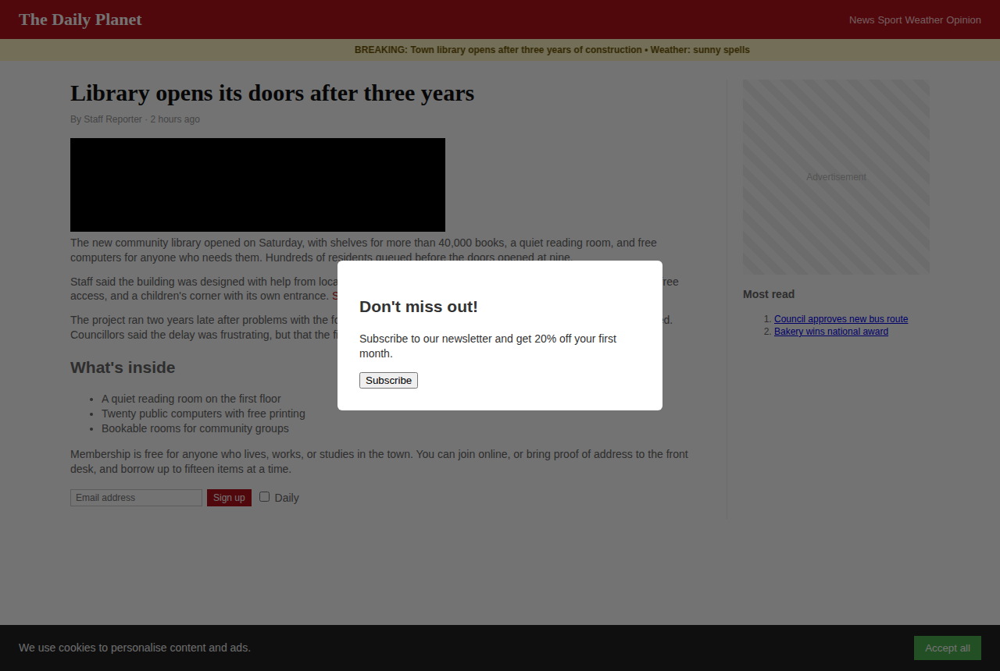
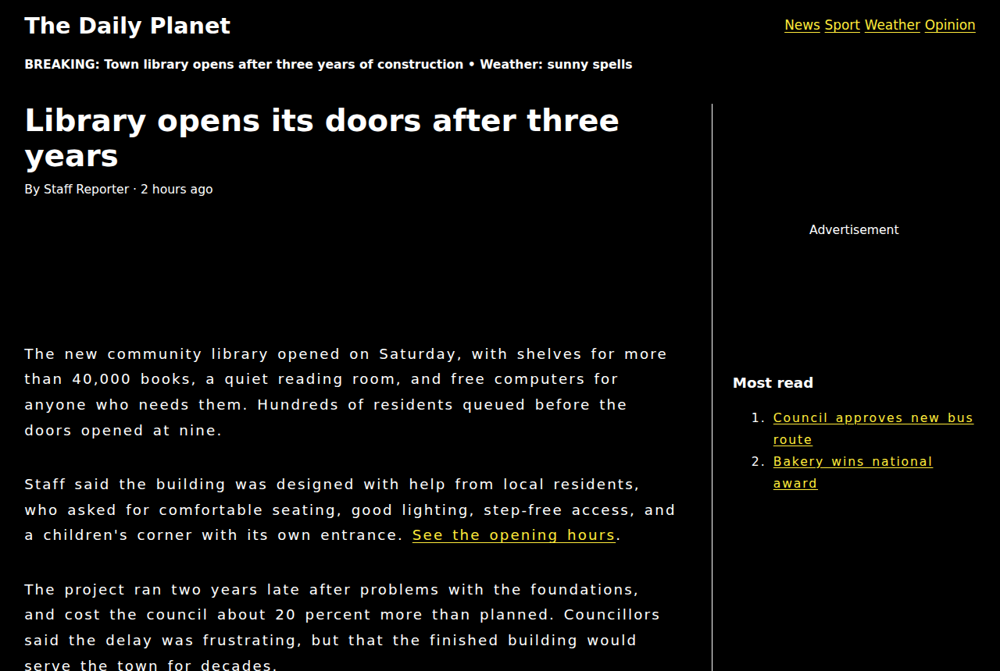

# Tailor: the web, fitted to you

**Working prototype.** A browser extension where you set your reading, colour, motion and control preferences once, and every website adapts to them. Your profile is encrypted, stays on your device and is never sent anywhere.

| Before | After (Low-vision profile) |
|---|---|
|  |  |

## Try it (Chrome, Edge, Brave, Arc)

1. Download this folder.
2. Go to `chrome://extensions` and turn on **Developer mode** (top right).
3. Click **Load unpacked** and pick the `tailor/extension` folder.
4. The setup page opens by itself. Choose a starting point, adjust anything you like, and click through.
5. Open any website. Pages that were already open need a refresh the first time.

Click the Tailor toolbar button on any site to switch it off for that site, or to open a **simplified version** of the page.

## What it does

**Setup (one time)** walks through five short screens, with a live preview that changes as you choose:

- **Reading:** size (up to double), lettering (extra clear, dyslexia-friendly, book style), line and letter spacing (up to the WCAG text-spacing levels), shorter line lengths
- **Colour:** dark, warm paper, and light or dark high contrast; always-underlined links
- **Calm:** stop animations, stop autoplaying video and sound, hide cookie banners and newsletter pop-ups
- **Controls:** bigger buttons and checkboxes, a bold keyboard-focus outline

It also offers presets (Low vision, Dyslexia-friendly, Calm & focused, Easier to tap & click) as a starting point.

**On every site:**
- The profile is applied as a stylesheet, and small scripts handle pop-ups and autoplay.
- A per-site on/off switch, remembered after reloads.
- **Simplify this page** pulls out the main text and shows it in a clean view styled to your profile. On Chrome versions that include the built-in, on-device Summarizer, a **Key points** button can summarise the page without sending it anywhere.

## Privacy design

| Principle | How the prototype does it |
|---|---|
| Sites never see your profile | Changes are made in your browser after the page arrives. Nothing is added to requests. |
| Encrypted at rest | The profile and site list are encrypted with AES-GCM (256-bit) before being saved. `chrome.storage` only ever holds ciphertext. |
| Key can't be copied by scripts | The key is generated on the device as a *non-extractable* Web Crypto key. No script, not even Tailor's own, can read its raw bytes. |
| Optional hardware-bound key | Turn on **passkey protection** and the data key is kept only in wrapped (encrypted) form. The key that unwraps it comes from your passkey's secure hardware (Touch ID, Windows Hello, Android, or a security key) after a fingerprint, face or PIN check. Copying the computer's files isn't enough to read the profile. |
| No server, no network | There is no Tailor backend. The extension's security policy sets `connect-src 'none'`, so its own pages can't make network requests even by mistake. |
| Page scripts can't read the simplified view | The reader view is built inside a closed Shadow DOM. |
| Few permissions | Only `storage`, plus the content script. It doesn't request `tabs`, `history` or `webRequest`. |
| One-click delete | "Delete everything" removes the data and destroys the key. |

## Passkey protection

Optional, and offered on the last setup screen.

**Turning it on:**
1. Tailor creates a passkey called "Tailor profile".
2. It asks the passkey for a secret using the WebAuthn PRF extension. The passkey computes that secret inside its secure hardware from a key that never leaves the chip, and only after checking your fingerprint, face or PIN.
3. The secret is stretched (HKDF-SHA-256) into a key that encrypts ("wraps") a brand-new random data key.
4. Your profile is re-encrypted with that data key. Only the wrapped copy is saved to disk, and the old device key is destroyed.

**Each browser session:**
- Unlock once from the toolbar button (it shows a red "!" while locked).
- The unwrapped data key is held in `chrome.storage.session`, which lives only in memory and is cleared when the browser closes.
- While locked, websites simply look the way they normally do.
- You can also lock straight away with **Lock now** in the popup.

**Trade-offs:**
- If you lose the passkey, nobody can recover the profile, including us. You would set it up again. That's deliberate.
- There's no server, so the passkey is used only for its secret, never to sign in to anything.
- Works in Chrome and Edge with passkeys and security keys that support PRF. Most current platform authenticators and FIDO2 keys do. If yours doesn't, Tailor says so and stays in standard mode.

## Tests

An end-to-end test loads the real extension into Chromium, completes setup, and checks that:
- storage contains only ciphertext and the key can't be exported
- passkey protection, using a virtual WebAuthn authenticator with PRF: turning it on re-encrypts the data and destroys the old key, and no raw key is written to disk. After a simulated browser restart the profile is locked and sites show normally. Unlocking restores it, and turning protection off keeps the data
- every setting is applied to a sample cluttered news page (`test/fixtures/news.html`)
- the per-site switch and reader view work
- deleting wipes everything

```bash
cd tailor
npm install
npm test
```

## Known limitations (honest list)

- **Standard mode isn't hardware-bound.** Without passkey protection, the non-extractable key stops scripts from copying it, but the browser still writes it to disk inside its profile folder. Turn on passkey protection to close that gap.
- **An unlocked session is only as safe as the running computer.** Once unlocked, the data key sits in the browser's memory until it closes, as with any password manager. Malware already running on the computer at that point could read it.
- **Sites can detect the changes.** A page's scripts can see computed styles (for example, bigger text or hidden banners) and could use them to fingerprint you. Only the reader view is hidden from them. Fully fixing this needs control at the browser level.
- **Brief flash on page load.** The profile comes from the background worker, so a page can show its original style for a moment before the changes apply.
- **Heuristics.** The pop-up hider and reader view use rules of thumb, and some sites will fool them. Heavy web apps (Google Docs, banking) can look odd with strong themes. That's what the per-site switch is for.
- **Fonts** such as Atkinson Hyperlegible and OpenDyslexic are used only if installed on the computer. They aren't bundled yet.
- Tested in Chromium. Firefox needs small manifest changes (background scripts instead of a service worker).

## Roadmap

1. ~~Hardware-bound key via passkeys (WebAuthn PRF)~~ Done
2. End-to-end encrypted sync between your devices, with no readable data on any server
3. On-device AI "plain language" rewriting and smarter page understanding (Chrome's built-in AI APIs, small local models)
4. Learning from behaviour ("you always zoom on this site")
5. An open, portable preference-profile format that other browsers and sites can adopt

## Layout

```
extension/
  manifest.json
  background.js           service worker: decrypts the profile for content scripts
  content.js              applies the profile on each page; pop-ups, autoplay, reader view
  lib/profile.js          profile shape, defaults, presets, validation
  lib/styles.js           profile -> CSS
  lib/vault.js            AES-GCM encrypted storage; standard or passkey-wrapped data key
  lib/passkey.js          WebAuthn PRF: creates the passkey, derives the wrapping key
  unlock/                 unlock page for passkey-protected profiles
  onboarding/             setup wizard with live preview
  popup/                  toolbar popup
test/
  e2e.js                  Playwright end-to-end test
  fixtures/news.html      deliberately cluttered sample site
docs/screenshots/         generated by the test
```
